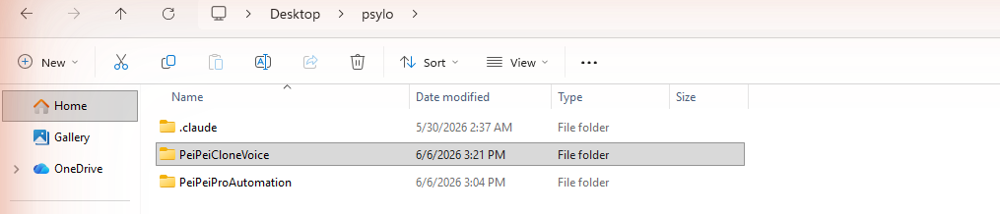
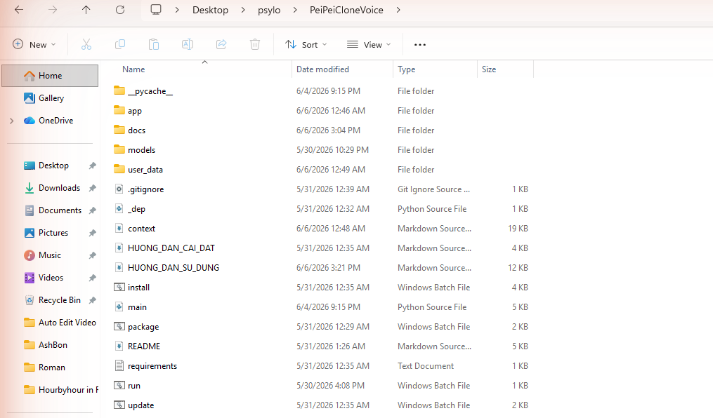
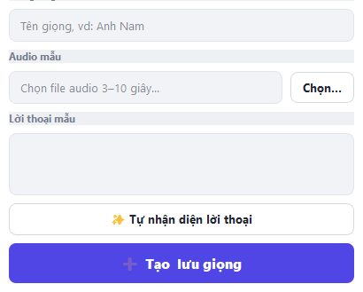
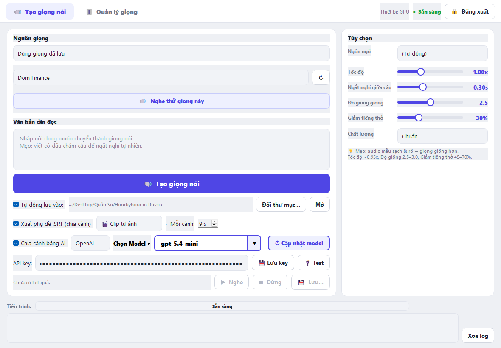
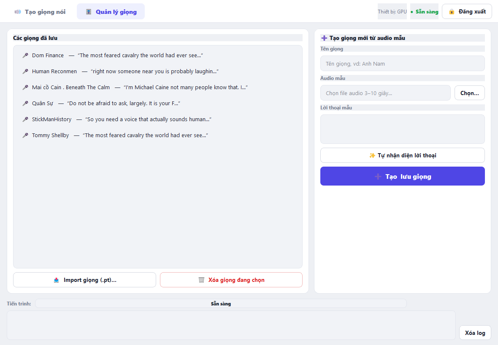
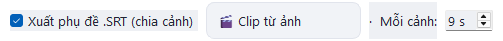
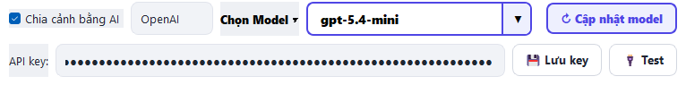

# 📘 PeiPei Clone Voice — Hướng dẫn sử dụng (có hình ảnh)

> **Gửi Cowork:** Đây là nội dung nguồn để tạo **file PDF hướng dẫn sử dụng** (tiếng Việt) cho người dùng cuối.
> Ảnh minh họa nằm trong thư mục `docs/images/` (đã nhúng sẵn vào tài liệu này). Khi xuất PDF, vui lòng giữ các ảnh đúng vị trí, thêm mục lục và đánh số trang. Đối tượng đọc là **người dùng phổ thông** — trình bày đơn giản, thân thiện.

---

## Mục lục
1. Giới thiệu
2. Yêu cầu máy tính
3. Cài đặt & mở ứng dụng
4. Đăng nhập
5. Tổng quan giao diện
6. Hướng dẫn nhanh (3 phút có audio đầu tiên)
7. Chi tiết tab "Tạo giọng nói"
8. Tab "Quản lý giọng"
9. Tính năng phụ đề .SRT (chia cảnh dựng video)
10. Tính năng "Chia cảnh bằng AI" (nâng cao)
11. Xử lý sự cố
12. Câu hỏi thường gặp

---

## 1. Giới thiệu

**PeiPei Clone Voice** là ứng dụng máy tính (Windows) giúp **nhân bản giọng nói bằng AI**. Bạn đưa vào một đoạn ghi âm giọng mẫu, ứng dụng học giọng đó và đọc **bất kỳ văn bản nào** bằng chính giọng ấy.

**Dùng để:**
- Tạo giọng đọc (voice-over) cho video YouTube, TikTok, phim kể chuyện…
- Đọc kịch bản dài bằng một giọng cố định.
- Xuất kèm **file phụ đề .SRT chia cảnh** để dựng video.

**Điểm mạnh:** hỗ trợ **tiếng Việt** và nhiều ngôn ngữ; lưu giọng dùng lại nhiều lần; chỉnh được tốc độ, ngắt nghỉ, độ giống giọng.

---

## 2. Yêu cầu máy tính

| Hạng mục | Yêu cầu |
|---|---|
| Hệ điều hành | Windows 10/11 (64-bit) |
| Card đồ họa | **Khuyến nghị: GPU NVIDIA** (RTX 3050 trở lên). Không có GPU vẫn chạy nhưng **rất chậm** |
| Ổ cứng trống | Khoảng **6 GB** (tải model AI lần đầu) |
| Internet | Cần cho **lần chạy đầu** (tải model ~4.7 GB) và khi dùng "Chia cảnh bằng AI" |

> 💡 **Lần đầu mở app sẽ lâu** vì phải tải model AI. Những lần sau mở nhanh hơn nhiều.

---

## 3. Cài đặt & mở ứng dụng

1. Tải/giải nén thư mục ứng dụng về máy (ví dụ đặt trong `psylo` ở Desktop). Mở vào thư mục **`PeiPeiCloneVoice`**:

   

2. Bên trong, tìm các file **`.bat`** (Windows Batch File):

   

3. Nháy đúp **`install`** (`install.bat`) → đợi cài xong. **Chỉ làm 1 lần** khi mới tải app về.
4. Mỗi khi muốn dùng, nháy đúp **`run`** (`run.bat`) để mở ứng dụng.
5. Khi có bản cập nhật mới, nháy đúp **`update`** (`update.bat`) để tải code mới nhất. *Giọng đã lưu, model và cài đặt của bạn không bị mất.*

> 💡 Cần hướng dẫn cài đặt chi tiết hơn (cài Python, tải app bằng Git…)? Xem file **`HUONG_DAN_CAI_DAT.md`** kèm theo app.

---

## 4. Đăng nhập

- Lần đầu mở, nhập **mật khẩu** (được người chia sẻ app cung cấp riêng).
- Tích **"Ghi nhớ trên máy này"** để lần sau khỏi nhập lại.
- Muốn thoát: bấm **🔒 Đăng xuất** ở góc trên bên phải.

> 📷 *[Ảnh: màn hình đăng nhập]*

---

## 5. Tổng quan giao diện

Ứng dụng có **2 thẻ (tab)** ở phía trên:
- **🔊 Tạo giọng nói** — nhập văn bản và tạo audio.
- **🎚️ Quản lý giọng** — tạo giọng mới, xem & xóa giọng đã lưu.

Góc trên bên phải: **thiết bị** (GPU/CPU) và **trạng thái** ("● Sẵn sàng" nghĩa là dùng được).

---

## 6. Hướng dẫn nhanh — 3 phút có audio đầu tiên

### Bước 1 — Tạo một giọng mới
Vào tab **🎚️ Quản lý giọng**, nhìn cột bên phải **"➕ Tạo giọng mới từ audio mẫu"**:

1. **Tên giọng**: đặt tên dễ nhớ, ví dụ *Anh Nam*.
2. **Audio mẫu**: bấm **"Chọn..."**, chọn file ghi âm giọng mẫu (**3–10 giây**, nói rõ, không nhạc nền).
3. **Lời thoại mẫu**: bấm **"✨ Tự nhận diện lời thoại"** để app tự điền (hoặc tự gõ đúng câu trong file).
4. Bấm **"➕ Tạo & lưu giọng"**.
5. App tạo xong sẽ **tự phát một câu mẫu** bằng giọng vừa tạo để bạn nghe thử có giống không.

### Bước 2 — Tạo audio từ văn bản
Quay lại tab **🔊 Tạo giọng nói**:

1. Phần **"Nguồn giọng"**: chọn **"Dùng giọng đã lưu"** → chọn tên giọng vừa tạo.
2. Phần **"Văn bản cần đọc"**: dán nội dung muốn đọc.
3. Bấm nút lớn **"🔊 Tạo giọng nói"** → đợi thanh tiến trình chạy xong.
4. Dùng **▶ Nghe** để nghe, **💾 Lưu...** để lưu file.

---

## 7. Chi tiết tab "Tạo giọng nói"

### 7.1. Nguồn giọng (cột trái, trên cùng)
Bấm vào ô để chọn 1 trong 3 cách:
- **Dùng giọng đã lưu** — chọn giọng đã tạo. Có nút **🔊 Nghe thử giọng này** và nút **↻** làm mới danh sách.
- **Dùng audio mẫu trực tiếp** — đưa thẳng file ghi âm vào, không cần lưu.
- **Thiết kế giọng (mô tả bằng lời)** — gõ mô tả giọng bằng tiếng Anh (vd: *a calm middle-aged male voice, deep pitch, warm tone*).

### 7.2. Bảng "Tùy chọn" (cột phải)
| Mục | Ý nghĩa | Gợi ý |
|---|---|---|
| **Ngôn ngữ** | Ngôn ngữ của văn bản | Chọn "Tiếng Việt" nếu đọc tiếng Việt |
| **Tốc độ** | Nhanh/chậm | Mặc định 1.00x |
| **Ngắt nghỉ giữa câu** | Khoảng lặng giữa câu cho tự nhiên | Mặc định 0.30s |
| **Độ giống giọng** | Càng cao càng giống mẫu (quá cao dễ méo) | 2.5–3.0 |
| **Giảm tiếng thở** | Làm nhỏ tiếng thở/tạp âm | Mặc định 30% |
| **Chất lượng** | Nhanh / Chuẩn / Cao | "Cao" đẹp hơn nhưng lâu hơn |

> 💡 **Mẹo giọng giống hơn:** dùng audio mẫu **sạch, rõ, không nhạc nền**. Nếu chưa giống, tăng "Độ giống giọng" hoặc dùng mẫu rõ/dài hơn.

### 7.3. Tự động lưu
- Tích **"Tự động lưu vào:"** để mỗi lần tạo xong tự lưu vào thư mục bạn chọn.
- **"Đổi thư mục..."** chọn nơi lưu; **"Mở"** mở nhanh thư mục đó.

### 7.4. Kết quả
- **▶ Nghe** — nghe audio vừa tạo · **■ Dừng** — dừng phát · **💾 Lưu...** — lưu ra nơi khác.

---

## 8. Tab "Quản lý giọng"

- **Các giọng đã lưu** (cột trái): danh sách giọng. Chọn 1 giọng rồi bấm **🗑 Xóa giọng đang chọn**.
- **📥 Import giọng (.pt)...**: nạp giọng từ file `.pt` có sẵn (chọn nhiều file cùng lúc được).
- **➕ Tạo giọng mới từ audio mẫu** (cột phải): như Mục 6 — Bước 1.

> 💡 Khi xóa một giọng, app **ghi nhớ** và **không tự khôi phục lại** ở lần mở sau.

---

## 9. Tính năng phụ đề .SRT (chia cảnh dựng video)

Tính năng này tạo kèm **file .srt** chia kịch bản thành từng **cảnh** để dựng video (mỗi cảnh = 1 ảnh hoặc 1 clip).

- Tích **"Xuất phụ đề .SRT (chia cảnh)"**.
- Chọn mục đích:
  - **🖼️ Video ảnh tĩnh** — mỗi cảnh ngắn hơn (hợp tạo ảnh tĩnh, cần mô tả chi tiết).
  - **🎬 Clip từ ảnh** — mỗi cảnh dài hơn (hợp tạo clip động, ví dụ Veo3).
- **"Mỗi cảnh: ___ s"** — chỉnh độ dài mong muốn cho mỗi cảnh.
- Mọi cảnh luôn nằm trong **4–10 giây** (không quá ngắn, không vượt giới hạn công cụ làm video).

File .srt được lưu **cùng tên, cùng thư mục** với file audio.

---

## 10. Tính năng "Chia cảnh bằng AI" (nâng cao — cần API key riêng)

Bình thường app tự chia cảnh bằng thuật toán. Nếu muốn chia cảnh **thông minh hơn theo ý nghĩa** (gom các câu cùng một ý vào một cảnh), bật tính năng này:

1. Tích **"Chia cảnh bằng AI"**.
2. Chọn **nhà cung cấp**: Gemini / OpenAI / Claude (tùy bạn có loại key nào).
3. Dán **API key** vào ô **"API key"**, bấm **💾 Lưu key**.
4. Bấm **🔌 Test** để kiểm tra key hoạt động không.
5. Bấm **↻ Cập nhật model** để lấy danh sách model mới nhất → bấm ô **"Chọn Model ▾"** (vùng có mũi tên ▼) để chọn model.

> **Lưu ý quan trọng:**
> - Mỗi loại (Gemini/OpenAI/Claude) lưu **key riêng**, không ghi đè nhau.
> - Nếu **không bật AI** hoặc **chưa có key**, app vẫn chia cảnh bình thường bằng thuật toán có sẵn.
> - **Mốc thời gian luôn lấy từ audio thật** → file SRT luôn khớp tiếng và đúng giới hạn 4–10 giây.
> - API key được lưu **trên máy bạn**, không gửi đi đâu khác.

---

## 11. Xử lý sự cố

| Hiện tượng | Cách xử lý |
|---|---|
| **Lần đầu mở rất lâu / đứng ở 1%** | Đang tải model AI (~4.7 GB). Đợi mạng tải xong. Nếu báo lỗi, kiểm tra Internet rồi mở lại. |
| **Clone giọng chậm bất thường** | Có thể bạn **mở 2 cửa sổ app cùng lúc** → cạn bộ nhớ GPU. Chỉ mở **một** cửa sổ. (Bản mới đã tự chặn mở 2 lần.) |
| **Chạy bằng CPU, rất chậm** | Máy không có GPU NVIDIA / driver chưa đúng. App vẫn chạy nhưng chậm. |
| **Giọng không giống** | Dùng mẫu rõ hơn/dài hơn, không nhạc nền; tăng "Độ giống giọng" lên 2.8–3.0. |
| **Bật AI báo lỗi (401/400…)** | Kiểm tra đã dán **đúng key của đúng nhà cung cấp** chưa → 💾 Lưu key → 🔌 Test lại. Lỗi AI **không** làm hỏng việc xuất SRT. |
| **Audio mẫu quá dài** | Nên dùng mẫu **3–10 giây**; mẫu quá dài bị cắt bớt. |

---

## 12. Câu hỏi thường gặp (FAQ)

**Hỏi: Cần Internet để tạo giọng không?**
Đáp: Chỉ cần ở **lần đầu** (tải model) và khi dùng **Chia cảnh bằng AI**. Tạo giọng bình thường chạy offline.

**Hỏi: File audio và giọng lưu ở đâu?**
Đáp: Trong thư mục `user_data` của ứng dụng (giọng: `user_data/voices`, audio: `user_data/outputs`). **Không nên xóa thư mục này.**

**Hỏi: Có tốn tiền không?**
Đáp: App và việc tạo giọng **miễn phí**. Chỉ khi bạn **tự dùng API key trả phí** cho "Chia cảnh bằng AI" mới phát sinh chi phí theo nhà cung cấp.

**Hỏi: Dùng được tiếng Việt không?**
Đáp: Có. Chọn "Tiếng Việt" ở phần Ngôn ngữ.

---

*Tài liệu nguồn cho Cowork — phiên bản 2026-06-04. Ảnh minh họa trong `docs/images/`. Vui lòng chuyển thành PDF hoàn chỉnh (mục lục, số trang, giữ ảnh đúng vị trí).*
